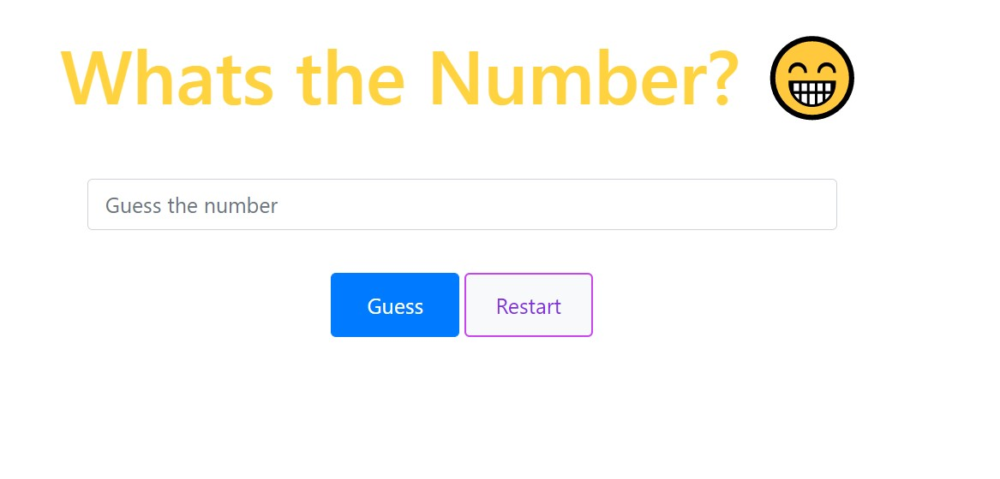
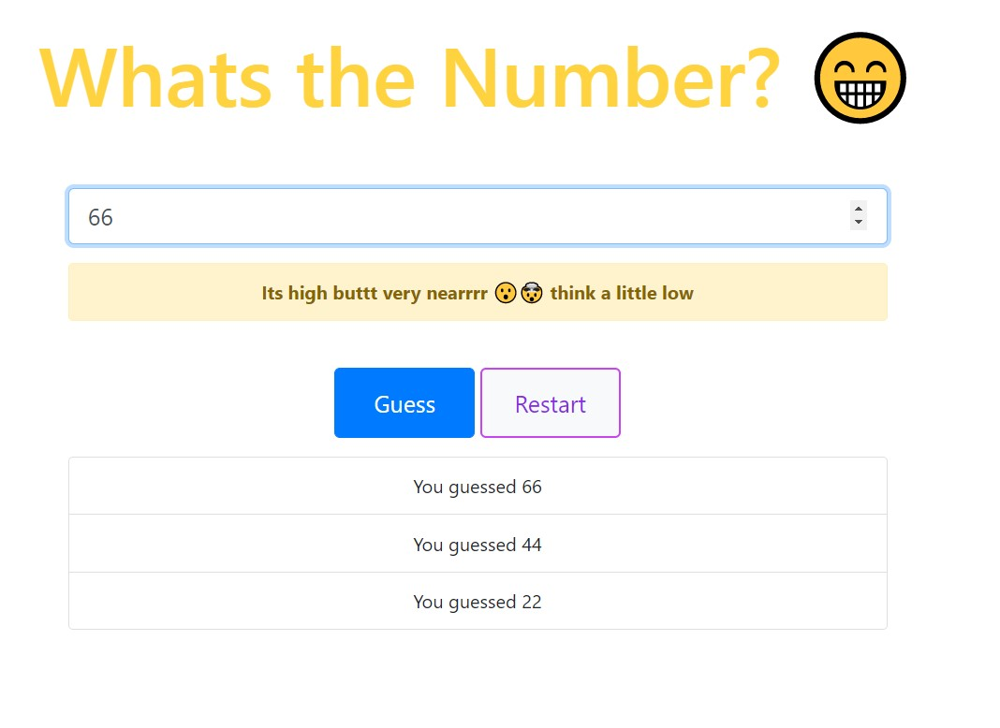
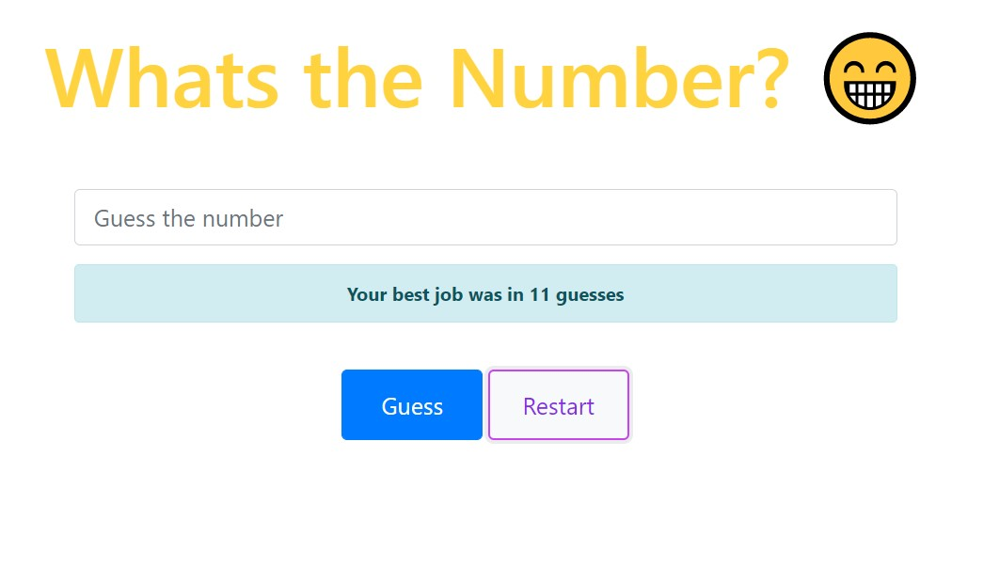

# JS_BASIC_NUMBER_GUESS_PROJECT
A very basic number guessing project as a kickstart of learning JS. This is my one of the first JS project.

## Screen Shots

### This is the front view of the main page of how the start of the game looks like



### This is the view of how the webpage will be looking while playing the game in the middle



### This is how the page will be looking after playing 2 games showing the best performance (least number of guesses so far)


### The sort of things I am able to learn here are:
1. How to use fucntions in JS
2. How to basic CSS statements
3. How to use ```document.getElementById``` method to do some amazzing stuffs with the inner HTML and dynamically
   adding HTML attributes with the help of JS (which was showing the second screen shot about how the history is being growing with more guesses
   
